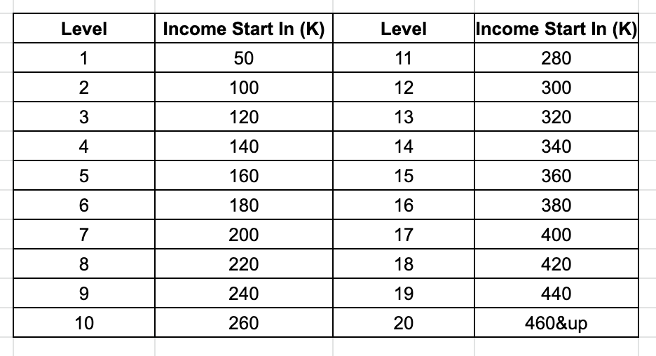

# Welcome to Neibourhood Finder

## Neibourhood Finder aims to help you find the preferable neighbors. 

**Here is the instruction**

Step 1: **select the income level** you would like to explore

The income level is divided based on income distribution: 

step 2: once level is selected, you can check the top N neighbors in the map (default N = 5), those neighbors are the most popular neighbors by mortgage count in that level. You can do multiple selection also =)

step 3: check the neighbor’s crime and school information by clicking on the specific neighbor

[Click! Start Find Your Neighborhoods!](https://public.tableau.com/profile/feng.wang2440#!/vizhome/NFversion3_0/Dashboard1?publish=yes)
